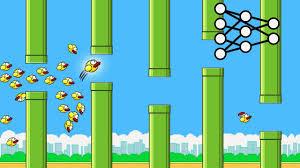
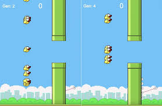

# AI-Flappy-Bird

It is an AI game build using deep learning and pygame. It is based on utilisation of Neuroevolution of augmenting topologies(NEAT) algorithm. This algorithm helps to train the AI by making simultaneous copies of itself at an initial level and then learn from each AI bird. This process keeps on running which is what we call evolution. The AI evolves itself to make itself better.  

## Parameters 
You can update the parameters of the neat algorithm by updating the config.txt file.
If you do not wish for training and just play the game then use my best model and load it.

## Future updates
The game can be upgraded by making the game complex or applying the same algorithms to some complex games.

